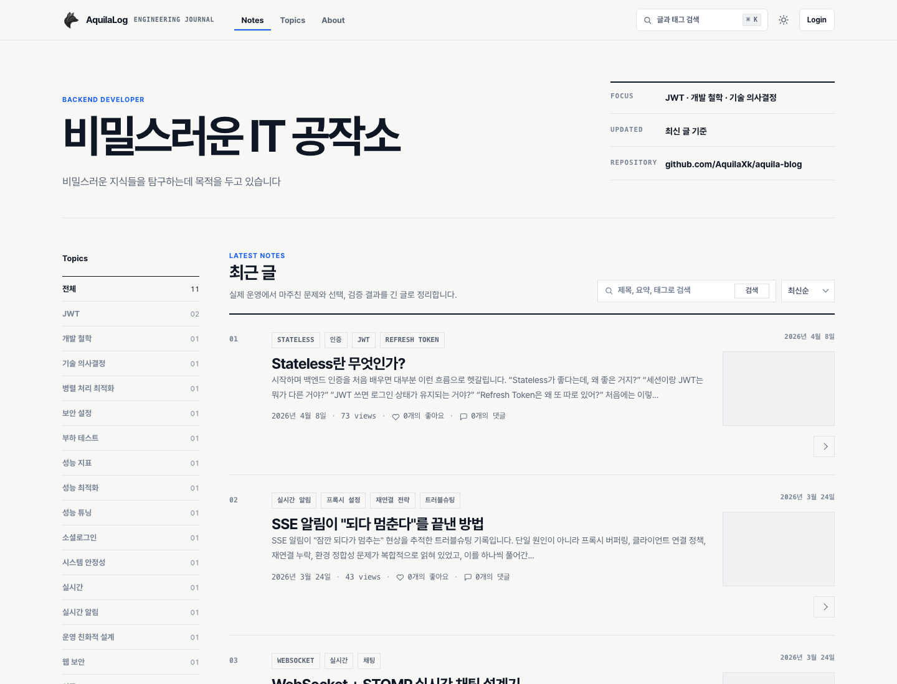
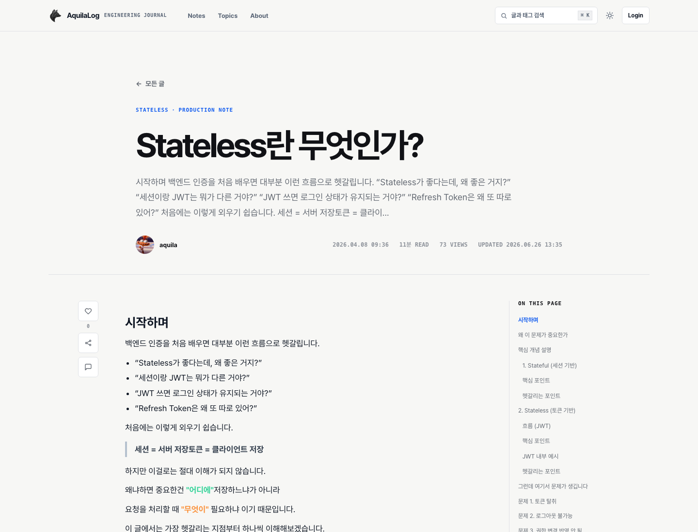
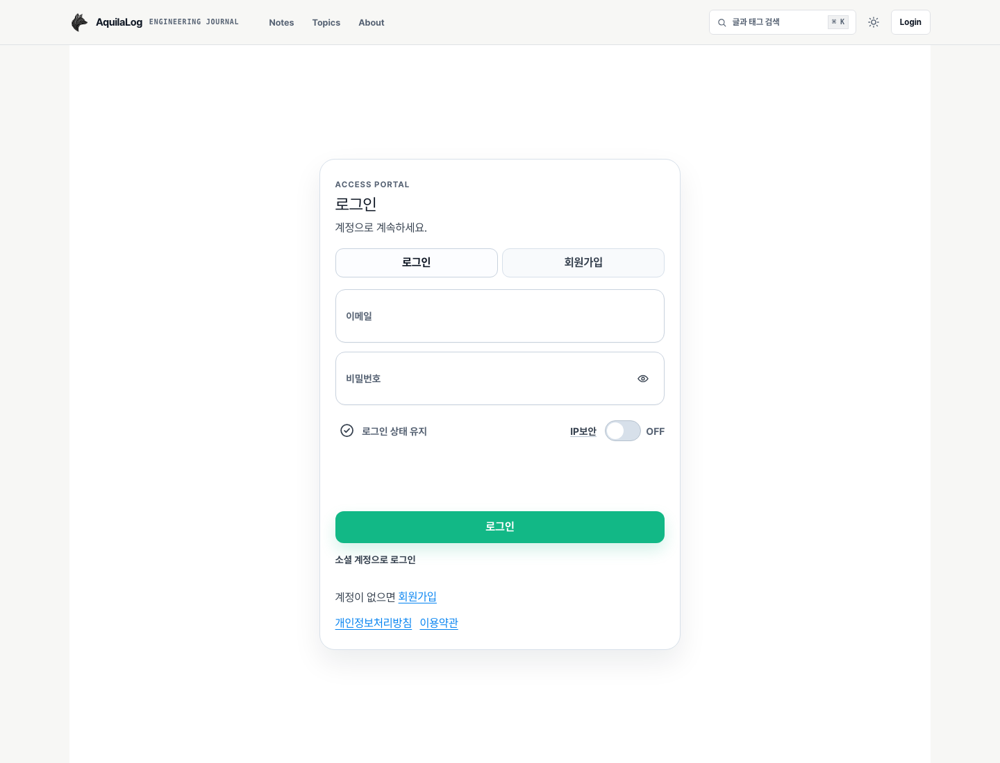
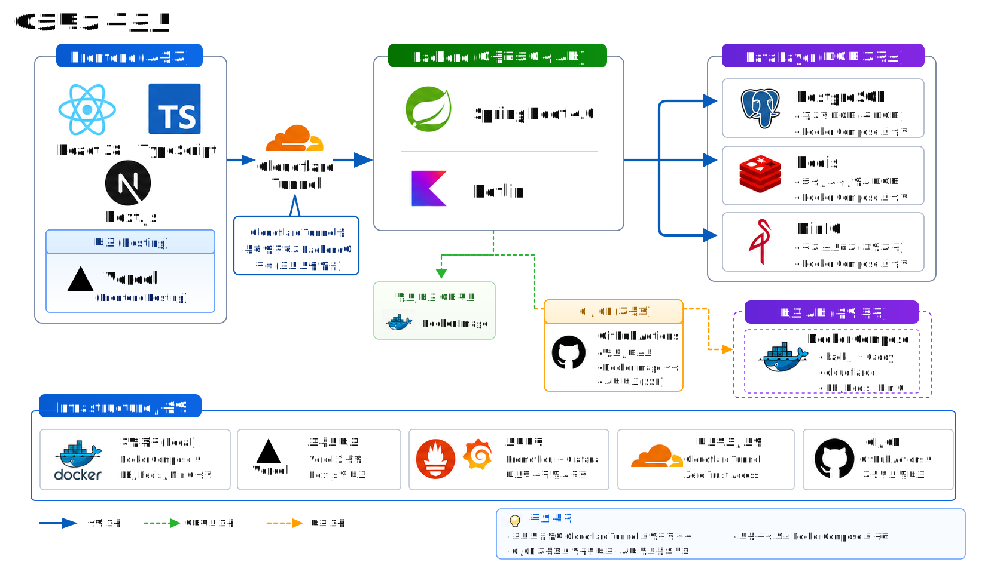

# Aquila Blog

> 공개 블로그, 관리자 글쓰기 작업실, 홈서버 배포를 포함한 개인 풀스택 기술 블로그 프로젝트입니다.

[Live Site](https://www.aquilaxk.site) ·
[Frontend](front/README.md) ·
[Backend](back/README.md) ·
[Deploy](deploy/homeserver/HARDENING.md) ·
[Docs](docs/README.md)


## Overview

Aquila Blog는 공개 블로그, 관리자 글쓰기 작업실, 백엔드 API, 홈서버 배포 구성을 하나의 저장소에 둔 개인 풀스택 프로젝트입니다.

단순 게시글 CRUD뿐 아니라 Markdown 렌더링, 검색/태그 탐색, 이미지 저장, 캐시, 배포, 모니터링, 회귀 검증처럼 실제 운영에 필요한 흐름까지 함께 다룹니다.

## Screenshots

<p align="center">
  
  
  
</p>

<p align="center">
  <sub>Feed overview · Post detail · Admin access portal</sub>
</p>

## Features

- **Public Blog**: 게시글 피드, 상세 페이지, 검색, 태그 기반 탐색
- **Content Studio**: 관리자 글 작성, 미리보기, 임시 저장, 발행 관리
- **Markdown Rendering**: GFM, 코드 하이라이트, Mermaid, 수식, 콜아웃 렌더링
- **Auth & Profile**: 로그인, OAuth, 프로필/작성자 정보 관리
- **Storage**: MinIO 기반 이미지 업로드와 정리 흐름
- **Operations**: 홈서버 배포, 헬스체크, 롤백, 모니터링, 회귀 검증

## Architecture

<p align="center">
  
</p>

```text
User / Admin
    |
    v
Vercel / Next.js
    |
    v
Home Server / Caddy + Cloudflare Tunnel
    |
    v
Spring Boot + Kotlin API
    |
    +-- PostgreSQL
    +-- Redis
    +-- MinIO
    +-- Prometheus / Grafana / Loki
```

## Tech Stack

| Area | Stack |
| --- | --- |
| Frontend | Next.js, React, TypeScript, Emotion, TanStack Query |
| Editor / Rendering | Tiptap, react-markdown, Mermaid, Shiki, KaTeX |
| Backend | Spring Boot, Kotlin, Spring Security, JPA, QueryDSL, Flyway |
| Data / Storage | PostgreSQL, Redis, MinIO |
| Infra / Deploy | Vercel, Home Server, Caddy, Cloudflare Tunnel, Docker Compose |
| Observability | Prometheus, Grafana, Loki, Promtail, Micrometer |
| Quality | JUnit5, Testcontainers, ArchUnit, Playwright, Storybook, k6 |

## Project Structure

```text
.
├── front/                  # Next.js frontend, admin/editor UI, Storybook, Playwright
├── back/                   # Spring Boot + Kotlin API server
├── deploy/homeserver/      # Production compose, Caddy, blue-green deploy, rollback, monitoring
├── perf/k6/                # Read-path load and chaos scenarios
├── docs/                   # Tracked user-facing design and legal document hub
├── tools/                  # Repository guards and automation scripts
├── infra/                  # Legacy / experimental Terraform setup
└── README.assets/          # Screenshots and README images
```

## Getting Started

### Prerequisites

- Java 24
- Node.js LTS
- Yarn Classic 1.22.x
- Docker / Docker Compose

### 1. Clone

```bash
git clone https://github.com/AquilaXk/aquila-blog.git
cd aquila-blog
```

### 2. Start Local Infrastructure

```bash
docker compose -f back/devInfra/docker-compose.yml up -d
```

### 3. Start Backend

```bash
cd back
./gradlew bootRun
```

### 4. Start Frontend

```bash
cd front
yarn install

NEXT_PUBLIC_BACKEND_URL=http://localhost:8080 \
BACKEND_INTERNAL_URL=http://localhost:8080 \
yarn dev
```

| Service | URL |
| --- | --- |
| Frontend | `http://localhost:3000` |
| Backend API | `http://localhost:8080` |
| Swagger UI | `http://localhost:8080/swagger-ui/index.html` |

## Environment Variables

Local development can run with the default development infrastructure. External integrations require additional variables.

| Variable | Used by | Description |
| --- | --- | --- |
| `NEXT_PUBLIC_BACKEND_URL` | Frontend | Browser-facing backend URL |
| `BACKEND_INTERNAL_URL` | Frontend SSR | Server-side backend URL |
| `CUSTOM__JWT__SECRET_KEY` | Backend | JWT signing key |
| `MINIO_ROOT_USER` / `MINIO_ROOT_PASSWORD` | MinIO | Local object storage credentials |
| `CUSTOM__AI__TAG__GEMINI__API_KEY` | Backend | Optional AI tag recommendation |
| `SPRING__SECURITY__OAUTH2__CLIENT__REGISTRATION__KAKAO__CLIENT_ID` | Backend | Optional Kakao OAuth client ID |

## Quality Checks

```bash
# Backend
cd back
./gradlew ktlintCheck
./gradlew test

# Frontend
cd ../front
yarn lint
yarn build
yarn contracts:check
```

Additional checks include Playwright E2E, Storybook gates, bundle-size checks, k6 load scenarios, and backend architecture tests.

## Documentation

| Document | Description |
| --- | --- |
| [Docs Hub](docs/README.md) | Tracked user-facing design and legal document entry point |
| [Frontend README](front/README.md) | Frontend routes, scripts, environment variables, and UI checks |
| [Backend README](back/README.md) | Backend architecture, API modules, quality checks, and OpenAPI flow |
| [k6 Guide](perf/k6/README.md) | Load and chaos scenarios for public read paths |
| [Home Server Hardening](deploy/homeserver/HARDENING.md) | Home server hardening and operational checklist |
| [Legacy Infra](infra/README.md) | Legacy cloud infra experiment; production uses homeserver deploy |
