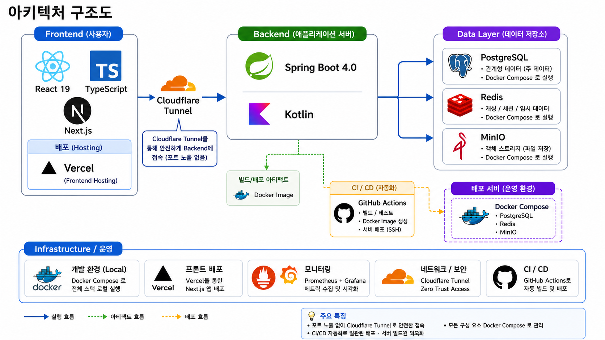
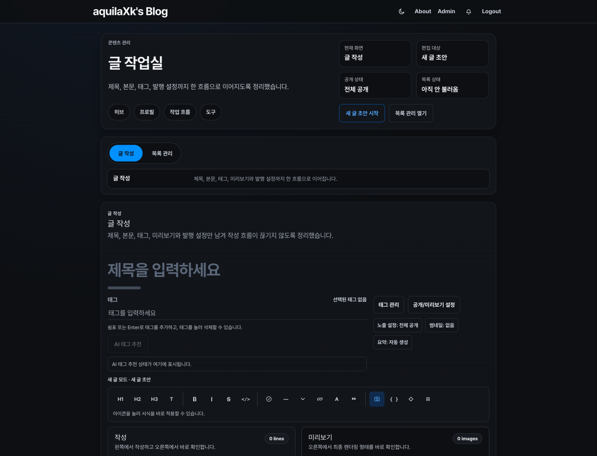

# Aquila Blog

> 운영 가능한 기술 블로그를 목표로 만든 풀스택 콘텐츠 플랫폼입니다.<br>
> 단순 게시글 CRUD보다 **실서비스 운영, 장애 복구, 배포 자동화, 회귀 방지**에 더 큰 비중을 두고 설계했습니다.

<p align="center">
  <a href="https://www.aquilaxk.site">
    
  </a>
  &nbsp;
  <a href="https://github.com/AquilaXk/aquila-blog">
    
  </a>
</p>

<p align="center">
  
  
  
  
  
</p>

---

## 목차

- [프로젝트 개요](#프로젝트-개요)
- [주요 기능](#주요-기능)
- [시스템 아키텍처](#시스템-아키텍처)
- [주요 설계 포인트](#주요-설계-포인트)
- [기술 스택](#기술-스택)
- [화면 및 운영 플로우](#화면-및-운영-플로우)
- [프로젝트 구조](#프로젝트-구조)
- [시작하기](#시작하기)
- [환경 변수](#환경-변수)
- [품질 게이트](#품질-게이트)
- [운영 및 배포](#운영-및-배포)
- [트러블슈팅 기록](#트러블슈팅-기록)
- [현재 상태와 개선 방향](#현재-상태와-개선-방향)
- [관련 링크](#관련-링크)

---

## 프로젝트 개요

### 배경

개인 기술 블로그는 글 작성과 공개만으로도 만들 수 있지만, 실제 운영을 계속하려면 게시글 렌더링, 인증, 이미지 저장, 배포 실패, 캐시 불일치, 성능 회귀까지 함께 다뤄야 합니다.

| 문제 | 운영에서 드러나는 영향 |
| --- | --- |
| 렌더링 회귀 | Markdown, Mermaid, 코드 블록, 표가 배포 후 깨질 수 있음 |
| 배포 실패 | 홈서버 배포 중 일부 컨테이너만 살아남으면 복구 기준이 흐려짐 |
| 캐시 불일치 | 글 수정 후 공개 상세 페이지가 오래된 내용을 보여줄 수 있음 |
| 운영 관측 부족 | 장애 원인을 로그와 지표로 추적하기 어려움 |

### 목표

Aquila Blog는 글 작성 도구와 공개 블로그를 하나로 묶고, 운영 중 문제가 생겨도 원인을 분리하고 복구할 수 있는 구조를 목표로 합니다.

| 구분 | AS-IS | TO-BE |
| --- | --- | --- |
| 콘텐츠 관리 | 글 작성, 미리보기, 발행 흐름이 분산됨 | 관리자 작업실에서 작성, 메타 편집, 미리보기, 발행을 연결 |
| 공개 읽기 경로 | 렌더링 실패와 캐시 실패가 사용자 경험에 바로 노출됨 | fallback, timeout, cache fail-open으로 공개 경로 방어 |
| 배포 운영 | 배포 성공 여부를 수동 확인에 의존 | Blue/Green, health probe, rollback, steady-state guard로 자동 판정 |
| 회귀 방지 | 화면과 계약 변경을 배포 후 확인 | Playwright, Storybook, OpenAPI contract, k6로 사전 검증 |

### 핵심 가치

- **운영 우선 설계**: 배포, 복구, 관측, 회귀 테스트를 프로젝트의 기본 기능으로 취급합니다.
- **방어적인 공개 경로**: 공개 피드와 상세 조회는 실패해도 가능한 한 읽기 경험을 유지하도록 설계합니다.
- **문서와 검증 동기화**: 장애 원인, 재발 방지, 검증 명령을 같은 작업 단위에서 남깁니다.

---

## 주요 기능

| 영역 | 기능 | 설명 |
| --- | --- | --- |
| Public Blog | 피드, 검색, 태그 탐색 | 공개 글 목록, 태그 필터, 검색 진입점을 제공합니다. |
| Public Blog | 글 상세 | 태그, 작성자, 본문, 좋아요, 댓글, 목차를 한 화면에서 제공합니다. |
| Content Rendering | Markdown 확장 | GitHub Flavored Markdown, Mermaid, 수식, 코드 하이라이팅, 콜아웃을 렌더링합니다. |
| Content Studio | 글 작성/수정 | 블록 기반 에디터, 태그, 썸네일, 요약, 공개 범위, 미리보기를 관리합니다. |
| Content Studio | 발행 관리 | 임시저장, 발행, 비공개, soft delete, 복구, 영구 삭제 흐름을 분리합니다. |
| Auth & Profile | 로그인/프로필 | 이메일 로그인, Kakao OAuth, 쿠키 기반 인증, 관리자 프로필 편집을 지원합니다. |
| Storage | 이미지 lifecycle | MinIO 기반 업로드, 임시 파일 활성화, 지연 삭제를 추적합니다. |
| Operations | 운영 도구 | doctor, recover, steady-state guard, 배포 상태 점검 스크립트를 제공합니다. |
| Observability | 모니터링 | Prometheus, Grafana, Loki, Promtail 기반 지표와 로그를 운영합니다. |

---

## 시스템 아키텍처



```text
[User / Admin]
      |
      v
[Vercel - Next.js 15 SSR]
  |   |   |
  |   |   +-- Public feed/detail, search, profile
  |   +------ Admin workspace, editor, preview
  +---------- API client with browser/server runtime boundary
      |
      v
[Home Server - Caddy + Cloudflare Tunnel]
      |
      v
[Spring Boot 4 + Kotlin]
  |   |   |
  |   |   +-- read/admin/worker runtime split
  |   +------ auth, post, comment, notification, storage domains
  +---------- OpenAPI contract and operational metrics
      |
      +-- PostgreSQL
      +-- Redis
      +-- MinIO
      +-- Prometheus / Grafana / Loki / Promtail
```

---

## 주요 설계 포인트

### 1. Hybrid Runtime

프런트엔드는 Vercel에서 SSR과 브라우저 런타임을 맡고, 백엔드는 홈서버에서 운영합니다. 백엔드 런타임은 `all`, `read`, `admin`, `worker` 모드로 나눌 수 있어 공개 읽기 경로와 관리자/작업 경로를 분리해 운영할 수 있습니다.

### 2. Defensive Read Path

공개 피드와 상세 조회는 캐시, Redis, cursor 조회가 실패해도 가능한 한 원본 데이터나 page fallback으로 복구하도록 설계했습니다. 캐시 stampede 완화, timeout, bulkhead, fail-open 정책을 공개 경로의 기본 계약으로 둡니다.

### 3. Editor and Rendering Contract

작성 화면과 공개 상세 화면은 같은 콘텐츠를 다르게 보여주기 때문에 회귀가 자주 생길 수 있습니다. Markdown, Mermaid, 코드 블록, 표, 토글, 콜아웃은 Playwright와 serialization 테스트로 검증하고, 글 저장 후 공개 상세 재검증 경로를 따로 둡니다.

### 4. Safe Deployment

홈서버 배포는 `deploy/homeserver/blue_green_deploy.sh`를 중심으로 동작합니다. 새 슬롯 배포, health check, Caddy 전환, 실패 시 rollback, 배포 후 steady-state guard 확인을 하나의 운영 경로로 묶었습니다.

---

## 기술 스택

| 영역 | 사용 기술 |
| --- | --- |
| Frontend | Next.js 15.5, React 18, TypeScript, Emotion, React Query |
| Editor | Tiptap 3, Markdown serialization, custom slash menu, Playwright editor QA |
| Content Rendering | react-markdown, remark-gfm, remark-math, Mermaid, rehype-pretty-code, Shiki, KaTeX |
| Backend | Java 24, Kotlin 2.2, Spring Boot 4.0, Spring Security, JPA, QueryDSL, Flyway |
| Data | PostgreSQL, Redis, MinIO |
| Infra | Vercel, Home Server, Caddy, Cloudflare Tunnel, Docker Compose, Terraform |
| Observability | Prometheus, Grafana, Loki, Promtail, Micrometer |
| Quality | ktlint, ArchUnit, JUnit 5, Testcontainers, Playwright, Storybook, k6, OpenAPI contract check |

---

## 화면 및 운영 플로우

### Feed


메인 피드는 태그 필터와 검색을 중심으로 공개 글을 빠르게 탐색하도록 구성했습니다.

### Post Detail


글 상세는 본문 가독성을 우선하면서 태그, 작성 메타, 반응 액션, 목차를 함께 제공합니다.

### Admin Workspace



관리자 작업실은 작성, 메타데이터 편집, 미리보기, 발행 판단을 한 흐름에서 처리하도록 구성했습니다.

### Content Publish Flow

| 단계 | 화면 / 주체 | 핵심 액션 | 반영 대상 | 운영 체크포인트 |
| --- | --- | --- | --- | --- |
| 1. Draft Start | `/admin/posts/new` | 제목과 본문 초안 작성 | `post.title`, `post.content` | 초안 유실 방지, 신규/수정 분기 |
| 2. Metadata Enrichment | 글 작업실 | 태그, 요약, 썸네일, 공개 범위 설정 | `post_tag_index`, `post_attr`, `uploaded_file` | 태그 품질, 이미지 연결, 공개 정책 |
| 3. Preview QA | 글 작업실 미리보기 | Markdown, 코드, Mermaid, 이미지 확인 | `post.content_html` | 발행 전 렌더링 깨짐 점검 |
| 4. Publish Control | 관리자 API | 발행, 비공개, soft delete, 복구 | `post.published`, `post.listed`, `post.deleted_at` | rollback 가능 여부 |
| 5. Delivery & Feedback | 공개 피드/상세 | 조회, 댓글, 좋아요, 알림 반영 | `post_attr`, `post_comment`, `post_like`, `member_notification` | 집계 정합성, SSE 알림 |

---

## 프로젝트 구조

```text
.
├── front/                  # Next.js frontend, admin/editor UI, Storybook, Playwright
├── back/                   # Spring Boot 4 + Kotlin backend
├── deploy/homeserver/      # Blue/Green 배포, 복구, Caddy, monitoring 스크립트
├── infra/                  # Terraform 기반 인프라 정의
├── perf/k6/                # 공개 읽기 경로 성능/chaos 시나리오
├── docs/                   # agent 작업 계획과 Superpowers spec/plan
├── tools/                  # repo guard, bundle-size, current-task 관련 도구
└── README.assets/          # README용 화면/아키텍처 이미지
```

---

## 시작하기

### 사전 요구사항

- Java 24
- Node.js LTS
- Yarn Classic 1.22.x
- Docker & Docker Compose

### 1. 저장소 클론

```bash
git clone https://github.com/AquilaXk/aquila-blog.git
cd aquila-blog
```

### 2. 개발용 인프라 실행

```bash
docker compose -f back/devInfra/docker-compose.yml up -d
```

기본 개발 인프라는 PostgreSQL, Redis, MinIO를 실행합니다.

| 서비스 | 기본 주소 |
| --- | --- |
| PostgreSQL | `localhost:5432` |
| Redis | `localhost:6379` |
| MinIO API | `localhost:9000` |
| MinIO Console | `localhost:9001` |

### 3. 백엔드 실행

```bash
cd back
./gradlew bootRun
```

- API: [http://localhost:8080](http://localhost:8080)
- Swagger UI: [http://localhost:8080/swagger-ui/index.html](http://localhost:8080/swagger-ui/index.html)

### 4. 프런트엔드 실행

```bash
cd front
yarn install
NEXT_PUBLIC_BACKEND_URL=http://localhost:8080 \
BACKEND_INTERNAL_URL=http://localhost:8080 \
yarn dev
```

- Frontend: [http://localhost:3000](http://localhost:3000)

---

## 환경 변수

로컬 개발은 기본값으로도 대부분 실행할 수 있습니다. 외부 연동이나 운영 모드에서는 아래 값을 명시합니다.

| 변수 | 사용 위치 | 설명 |
| --- | --- | --- |
| `NEXT_PUBLIC_BACKEND_URL` | Frontend | 브라우저 런타임에서 접근할 API base URL |
| `BACKEND_INTERNAL_URL` | Frontend SSR | 서버 런타임에서 접근할 API base URL |
| `CUSTOM__JWT__SECRET_KEY` | Backend | JWT 서명 키, 운영에서는 32 bytes 이상 필요 |
| `SPRING__DATA__REDIS__PASSWORD` | Backend | Redis 비밀번호 |
| `CUSTOM__AI__TAG__GEMINI__API_KEY` | Backend | AI 태그 추천을 실제 호출로 확인할 때 사용 |
| `SPRING__SECURITY__OAUTH2__CLIENT__REGISTRATION__KAKAO__CLIENT_ID` | Backend | Kakao OAuth client ID |
| `MINIO_ROOT_USER`, `MINIO_ROOT_PASSWORD` | Infra | MinIO root 계정 |

전체 기본값과 운영 프로필은 `back/src/main/resources/application.yaml`, `application-dev.yaml`, `application-prod.yaml`에서 확인할 수 있습니다.

---

## 품질 게이트

### Backend

```bash
cd back
./gradlew ktlintCheck
./gradlew compileKotlin
./gradlew test
```

`./gradlew test`는 `back/testInfra/docker-compose.yml` 기반 테스트 인프라를 함께 사용합니다.

### Frontend

```bash
yarn --cwd front lint
yarn --cwd front build
yarn --cwd front check:bundle-size
yarn --cwd front test:e2e:smoke
yarn --cwd front test:e2e:perf
yarn --cwd front test:e2e:a11y
yarn --cwd front storybook:gate
yarn --cwd front contracts:check
```

Playwright 계열 스크립트는 `playwright:preflight`를 먼저 실행해 로컬 브라우저 실행 계약 드리프트를 fail-fast로 확인합니다.

---

## 운영 및 배포

```text
작업 브랜치
  -> PR to main
  -> CI / guard / security 검증
  -> main merge
  -> 홈서버 자동 배포
  -> Blue/Green cutover
  -> health probe / steady-state guard
```

| 도구 | 역할 |
| --- | --- |
| `deploy/homeserver/blue_green_deploy.sh` | 새 백엔드 슬롯 배포, health check, Caddy 전환 |
| `deploy/homeserver/rollback_last_deploy.sh` | 마지막 정상 배포본으로 rollback |
| `deploy/homeserver/recover.sh` | 운영 컨테이너 복구 |
| `deploy/homeserver/doctor.sh` | 홈서버 상태 진단 |
| `deploy/homeserver/steady_state_guard.sh` | Caddy mount, readiness, 단일 실행 규칙 점검 |
| `deploy/homeserver/monitoring/` | Prometheus, Grafana, Loki, Promtail 구성 |

---

## 트러블슈팅 기록

이 프로젝트의 장애 대응은 원인, 대책, 검증을 같은 작업 단위에 남기는 방식을 따릅니다.

| 이슈 유형 | 원인 분리 방식 | 재발 방지 |
| --- | --- | --- |
| Blue/Green 전환 실패 | health probe, Caddy 전환, 이전 슬롯 종료 단계를 분리해 확인 | rollback 스크립트와 steady-state guard로 종료 조건 고정 |
| 공개 상세 stale 응답 | 관리자 저장, revalidate API, SSR/cache 계층을 분리해 추적 | 저장 후 revalidate와 공개 상세 회귀 테스트 유지 |
| Markdown 렌더링 회귀 | 작성 surface, serialization, 공개 renderer를 분리해 재현 | smoke, mobile-layout, editor serialization, mermaid 테스트 유지 |
| Redis/cache 장애 | source fallback과 cache fail-open 여부를 확인 | 공개 읽기 경로 fallback 정책과 운영 로그 유지 |

---

## 현재 상태와 개선 방향

| 현재 상태 | 다음 개선 방향 |
| --- | --- |
| 공개 블로그와 관리자 작성 흐름 운영 가능 | 에디터 대형 모듈을 더 작은 책임 단위로 지속 분해 |
| Blue/Green 배포와 운영 스크립트 보유 | 배포 후 실페이지 자동 계측 범위 확대 |
| Markdown/Mermaid/코드블록 회귀 테스트 보유 | 콘텐츠 fixture 기반 렌더링 회귀 케이스 확대 |
| 모니터링 대시보드와 로그 수집 보유 | 알림 규칙과 운영 런북 정리 강화 |

---

## 관련 링크

| 구분 | URL |
| --- | --- |
| 서비스 | [www.aquilaxk.site](https://www.aquilaxk.site) |
| GitHub | [AquilaXk/aquila-blog](https://github.com/AquilaXk/aquila-blog) |
| Frontend README | [front/README.md](front/README.md) |
| k6 시나리오 | [perf/k6/README.md](perf/k6/README.md) |
| 홈서버 운영 문서 | [deploy/homeserver/HARDENING.md](deploy/homeserver/HARDENING.md) |
| 인프라 문서 | [infra/README.md](infra/README.md) |
