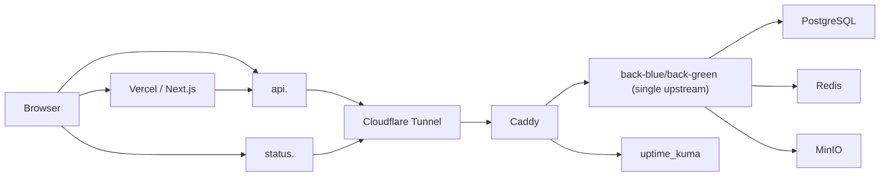
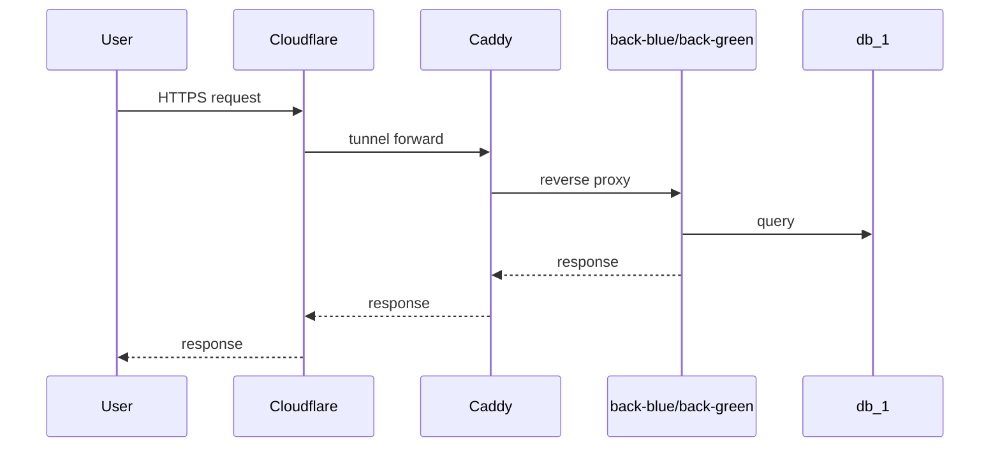

# Infrastructure Architecture

Last updated: 2026-03-15

## 3줄 요약

- 배포 런타임과 실제 네트워크 흐름을 볼 때 이 문서를 먼저 읽는다.
- 운영 구조는 `Vercel + Cloudflare Tunnel + Caddy + Home Server(back/db/redis/minio/uptime_kuma)` 하이브리드 구성이다.
- OAuth/프록시/forwarded header 이슈는 이 문서를 기준으로 보고, 배포 절차는 `DevOps.md`로 내려간다.

## 이 문서가 보여주는 것

이 문서는 프론트와 백엔드를 다른 런타임에 두는 하이브리드 구조를 어떻게 운영 가능한 인프라로 묶었는지를 설명한다.

## 런타임 토폴로지

운영 구성은 Vercel과 홈서버를 분리한 하이브리드 구조다.

## 홈서버 Docker Compose 서비스

`deploy/homeserver/docker-compose.prod.yml` 기준:

- `cloudflared`
  Cloudflare Tunnel 프로세스
- `caddy`
  외부 HTTP/HTTPS 진입점
- `back_blue`
  비활성/활성 후보 백엔드
- `back_green`
  비활성/활성 후보 백엔드
- `db_1`
  PostgreSQL
- `redis_1`
  Redis
- `minio_1`
  S3 호환 object storage
- `uptime_kuma`
  운영 가용성 모니터링/Status Page

## 서비스 매트릭스

| 서비스 | 포트/접점 | 영속성 | 역할 |
| --- | --- | --- | --- |
| `cloudflared` | Cloudflare tunnel | 없음 | 외부 트래픽 진입 |
| `caddy` | `80`, `443` | `caddy_data`, `caddy_config` | TLS, reverse proxy |
| `back_blue`, `back_green` | 내부 `8080` | 없음 | 앱 실행체 |
| `db_1` | 내부 `5432` | `db_data` | 정규 데이터 |
| `redis_1` | 내부 `6379` | appendonly | 세션/캐시 |
| `minio_1` | 내부 `9000`, `9001` | `minio_data` | 오브젝트 저장소 |
| `uptime_kuma` | 내부 `3001` | `uptime_kuma_data` | 상태 모니터링 |

## 라우팅 원칙

- Caddy는 항상 단일 색상 upstream(`back-blue:8080` 또는 `back-green:8080`)만 바라본다.
- 배포 스크립트가 Caddyfile의 upstream host를 target backend로 교체하고 reload한다.
- Docker network alias 이동(`back_active`)에 의존하지 않는다.
- Cloudflare Tunnel -> Caddy 구간은 HTTP origin이지만, Caddy는 backend로 `X-Forwarded-Proto=https`, `X-Forwarded-Host`, `X-Forwarded-Port=443`를 명시해서 외부 scheme 정보를 복원한다.

이 구조 덕분에 alias DNS 불안정 이슈를 피하면서도 blue/green 전환을 유지할 수 있다.

## 스토리지/볼륨

- `db_data`: PostgreSQL 영속 데이터
- `minio_data`: MinIO object storage 데이터
- `caddy_data`, `caddy_config`: Caddy 인증서/설정 캐시

즉, 재배포가 일어나도 DB와 이미지 스토리지는 유지된다.

## 외부 노출 전략

- 프론트는 Vercel 도메인 또는 커스텀 도메인에서 제공
- 백엔드는 `api.<domain>`으로 노출
- 모니터링/상태 페이지는 `status.<domain>`으로 분리 노출
- 홈서버는 직접 포트포워딩 대신 Cloudflare Tunnel 사용이 기본 전제
- OAuth callback URL은 프록시 추론 실패에 흔들리지 않도록 `${custom.site.backUrl}/login/oauth2/code/{registrationId}`로 고정한다.

## 장애 경계

- 프론트 장애: Vercel/Next 빌드 실패, 잘못된 API base URL
- API 장애: backend 컨테이너 크래시, 잘못된 env, DB/Redis/MinIO 연결 실패
- 프록시 장애: Caddy upstream host 오선택/미전환, tunnel misroute
- 데이터 계층 장애: DB volume 손상, Redis 인증 오류, MinIO endpoint/secret 오류

## 배포 전환 상태표

| 상태 | 활성 backend | Caddy upstream | 사용자 영향 |
| --- | --- | --- | --- |
| 평상시 | `back_blue` 또는 `back_green` | `back-blue` 또는 `back-green` | 정상 |
| 신규 기동 중 | 기존 active 유지 | 기존 upstream 유지 | 정상 |
| 전환 직후 | 신규 backend | target backend host | 정상 또는 짧은 검증 구간 |
| rollback 중 | 직전 정상 backend | rollback target host | 영향 최소화 목표 |

## 최근 운영에서 중요해진 포인트

- `HOME_SERVER_ENV`가 실제 운영 설정을 덮어쓴다.
- MinIO 관련 env는 `${...}` placeholder를 넣지 말고 완성된 값을 넣어야 한다.
- 배포 스크립트는 storage endpoint와 Caddy upstream route를 더 엄격하게 검증하도록 강화되어 있다.
- Kakao OAuth에서 `redirect_uri`가 `http://...`로 내려가는 현상은 대부분 프록시 forwarded header 또는 `custom.site.backUrl` 오설정에서 시작된다.

## 참고 파일

- `deploy/homeserver/Caddyfile`
- `deploy/homeserver/docker-compose.prod.yml`
- `deploy/homeserver/blue_green_deploy.sh`
- `.github/workflows/deploy.yml`
