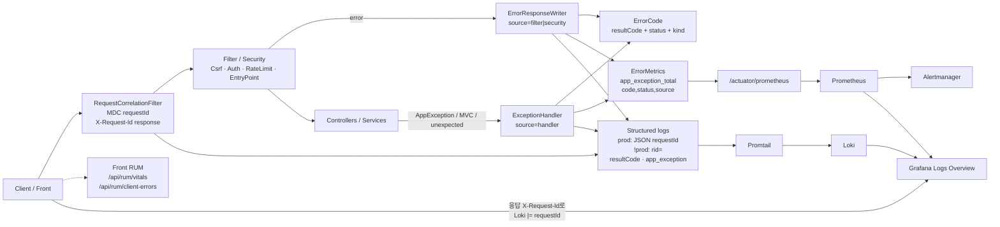

# Observability Operations Runbook

홈서버 Loki + Grafana + Prometheus + Alertmanager 기준 에러 조회·알림 대응 단일 운영 문서다.

- Epic: #1288 / Issue: #1300
- 기준 tip: `feat/error-metrics-alerts` (ErrorCode + `ErrorResponseWriter` + `app_exception_total` + error alerts)
- 코드표: [`docs/design/error-codes.md`](./error-codes.md)
- Alert rules: `deploy/homeserver/monitoring/rules/*.yml` (`task-alerts.yml` + `error-alerts.yml` + `cloud-media-alerts.yml`)
- 로그 대시보드: Grafana **Aquila Logs Overview** (`blog-logs-overview.json`)
- 클라우드 미디어: Grafana **Blog Cloud Media** (`blog-cloud-media.json`) — 검증 보조 [`docs/ops/cloud-media-metrics-verify.md`](../ops/cloud-media-metrics-verify.md)

> **검증 범위 (PR)**  
> LogQL/PromQL은 저장소 dashboard JSON의 라벨·필드 규약과 best-effort로 정합했다.  
> Grafana live 쿼리 실행과 배포 후 requestId correlation은 **post-merge ops check**다.

---

## 1. 에러 조회 LogQL cookbook

공통 스트림 셀렉터 (대시보드와 동일):

```logql
{compose_project="blog_home",service=~"back_.*|back.*"}
```

로그 패턴 (`logback-spring.xml`):

| 프로필 | 인코더 | requestId 형태 |
| --- | --- | --- |
| **prod** | `LogstashEncoder` (`includeMdc=true`) | JSON 필드 `requestId` (MDC). plain `rid=` 접두는 **없다** |
| **!prod** | plain pattern | `rid=%X{requestId}` + 메시지 본문의 `resultCode=` / `requestId=` |

구조화 메시지(`app_exception` / `error_response` / `api_error`)에는 양쪽 모두 `resultCode=…`가 찍힌다. **홈서버(prod) Loki 조회는 JSON `requestId`가 정본**이다.

### 1.1 requestId로 단일 요청 추적

대시보드 변수 `$requestId`와 동일. UUID 또는 `X-Request-Id` 값을 그대로 넣는다.

프로필 무관하게 UUID 문자열로 찾기 (prod JSON·!prod plain 모두 매칭):

```logql
{compose_project="blog_home",service=~"back_.*|back.*"} |= "<REQUEST_ID>"
```

**prod** — JSON/Logstash MDC `requestId`로 좁히기:

```logql
{compose_project="blog_home",service=~"back_.*|back.*"} |= `"requestId":"<REQUEST_ID>"`
```

```logql
{compose_project="blog_home",service=~"back_.*|back.*"} | json | requestId="<REQUEST_ID>"
```

**!prod only** — plain console의 `rid=` 접두:

```logql
{compose_project="blog_home",service=~"back_.*|back.*"} |= "rid=<REQUEST_ID>"
```

Caddy 액세스 로그까지 포함:

```logql
{compose_project="blog_home",service=~"back_.*|back.*|caddy"} |~ "(?i)(x-request-id|requestid|request_id|<REQUEST_ID>)"
```

### 1.2 백엔드 ERROR 스트림 / 시간대

최근 ERROR 로그만:

```logql
{compose_project="blog_home",service=~"back_.*|back.*"} |= "ERROR"
```

ERROR 비율(대시보드 Backend ERROR Rate와 동일, 5m):

```logql
(
  sum(count_over_time({compose_project="blog_home",service=~"back_.*|back.*"} |= "ERROR" [5m]))
  /
  sum(count_over_time({compose_project="blog_home",service=~"back_.*|back.*"}[5m]))
) * 100
```

Grafana Explore에서 time picker로 장애 구간을 고정한 뒤 위 쿼리를 실행한다. CLI로는 `--from`/`--to`에 해당 구간을 넣는다.

구조화 앱 예외·5xx 시그니처:

```logql
{compose_project="blog_home",service=~"back_.*|back.*"}
  |~ "app_exception|error_response|unhandled_server_exception|api_error"
```

### 1.3 resultCode 필터

코드 의미는 [`error-codes.md`](./error-codes.md)를 본다. 로그 필드명은 `resultCode=`.

단일 코드:

```logql
{compose_project="blog_home",service=~"back_.*|back.*"} |= "resultCode=403-2"
```

대역(예: 403-*):

```logql
{compose_project="blog_home",service=~"back_.*|back.*"} |~ "resultCode=403-[0-9]+"
```

5xx DEVELOPER 코드:

```logql
{compose_project="blog_home",service=~"back_.*|back.*"} |~ "resultCode=5[0-9]{2}-[0-9]+"
```

메트릭 쪽 `code` 태그(동일 값, Prometheus):

```promql
sum by (code, status, source) (rate(app_exception_total[5m]))
```

```promql
sum by (code) (rate(app_exception_total{code="403-2"}[15m]))
```

Top-N (대시보드 App Exception Top-N by code와 동일):

```promql
topk(10, sum by (code) (rate(app_exception_total[5m])))
```

### 1.4 `app_exception_total` ↔ 로그 조사 순서

1. **메트릭으로 스파이크 코드 확정**  
   `topk(10, sum by (code) (rate(app_exception_total[5m])))`  
   필요 시 `status`/`source`(`handler`|`filter`|`security`)로 분해.
2. **같은 구간의 Loki에서 해당 `resultCode` 필터**  
   `|= "resultCode=<code>"` → 경로·메시·스택 패턴 확인.
3. **대표 로그에서 requestId 추출** 후 §1.1로 단일 요청 타임라인 복원.  
   prod: JSON `requestId` 필드 · !prod: plain `rid=` / 메시지 `requestId=`.
4. **HTTP status만 보이는 패널과 교차**  
   `http_server_requests_*`의 5xx/403과 `app_exception_total`이 어긋나면 filter/security 경로(`ErrorResponseWriter`) 또는 status-only 응답을 의심한다.
5. **프론트 RUM**  
   응답 `X-Request-Id` / (병합 후) `ApiError.requestId`가 있으면 동일 id로 Loki를 조회한다. RUM만으로는 resultCode가 없으므로 백엔드 로그가 정본이다.

알림 `AquilaAppException5xxSpike` / `AquilaAppException403Spike`가 울리면 1→2→3 순서를 그대로 따른다.

---

## 2. Alert → 대응 매핑 표

소스: `deploy/homeserver/monitoring/rules/task-alerts.yml` (41) + `error-alerts.yml` (2) + `cloud-media-alerts.yml` (10) = **53 rules**.  
cloud-media 검증·패널 매핑은 [`docs/ops/cloud-media-metrics-verify.md`](../ops/cloud-media-metrics-verify.md)와 Grafana **Blog Cloud Media** (`blog-cloud-media.json`)를 본다.

| Alert | 의미 | 첫 확인 대시보드·쿼리 | 1차 조치 |
| --- | --- | --- | --- |
| AquilaTaskQueueBacklogHigh | ready 큐 적체 >500 (10m) | Overview「작업 큐 적체」 / `task_queue_ready_pending` | worker 로그·핸들러 지연 확인, 필요 시 worker scale / API·worker 분리 |
| AquilaTaskQueueStaleProcessing | stale processing ≥3 (5m) | Overview 큐 패널 / `task_queue_stale_processing` | worker 헬스·stuck handler·DLQ 확인 |
| AquilaApiLatencyP95High | API p95 >1s (10m, actuator 제외) | Overview「HTTP p95」 | DB/Redis/큐 압력, 최근 배포 롤백 여부 |
| AquilaFeedLatencyP95High | Feed p95 >1s (10m) | Feed Performance「Feed p95」 | feed 캐시 hit·DB·업스트림 타이밍 |
| AquilaFeedLatencyP99High | Feed p99 >2s (10m) | Feed Performance「Feed p99」 | outlier 쿼리·업스트림 포화 |
| AquilaFeedOutlierOver5sRatioHigh | Feed >5s 비율 >3% (10m) | Feed Performance「>5s outlier」 | 캐시/TTL·timeout budget·DB plan |
| AquilaPostReadFeedCacheHitRatioLow | feed 캐시 hit <35% (15m) | Feed Performance「Feed cache hit」 / Overview cache 패널 | 키 churn·purge·TTL |
| AquilaFeedOriginErrorRateHigh | Feed 5xx 비율 >2% (10m) | Feed Performance「Feed origin 5xx」 + Logs Overview | ExceptionHandler/로그, timeout, 롤백 기준 |
| AquilaBackScrapeDown | API scrape `up` 없음 (3m) | Overview「Back API scrape health」 / `up{job="back",component="api"}` | back_blue/green 컨테이너·`/actuator/prometheus` |
| AquilaBackReadinessDown | API readiness 200 없음 (3m) | Overview + `aquila_backend_readiness_up` | readiness 실패 원인(DB/Redis)·active color |
| AquilaBackWorkerScrapeDown | worker scrape down (3m) | `up{component="worker"}` | **이메일 drop route** — worker 컨테이너/`doctor.sh`·steady_state_guard 로그 |
| AquilaBackRuntimeSplitScrapeDown | 실행 중 read/admin scrape down (3m) | `up{component=~"read\|admin"}` + docker probe | runtime-split 컨테이너·스크rape target |
| AquilaTaskDlqRateHigh | DLQ rate >0 (10m) | `task_processor_result_total{status="dlq"}` | 실패 핸들러·replay 정책 |
| AquilaPostSearchIndexLagP95High | 검색 인덱스 lag p95 >120s (10m) | `post_search_index_task_lag_seconds_bucket` | search index worker·큐 |
| AquilaDockerRuntimeProbeScrapeDown | docker_runtime_probe scrape down (3m) | `up{job="docker_runtime_probe"}` | **이메일 drop route** — probe 컨테이너·docker.sock·steady_state_guard |
| AquilaContainerRestarted | 핵심 컨테이너 restart 증가 (15m) | Runtime Guard / docker restart 메트릭 | 배포 churn·OOM·crash loop 로그 |
| AquilaContainerOomKilled | OOMKilled 보고 | Runtime Guard / memory 패널 | limit limit·heap·호스트 메모리 |
| AquilaApiRateLimitRejectedHigh | Redis rate-limit reject >0.5 rps (5m) | `api_rate_limit_rejected_total` + Logs `resultCode=429-10` | Cloudflare WAF/rate limit·공격 IP |
| AquilaApi429RatioHigh | HTTP 429 비율 >10% (5m) | Overview 요청/상태 + 429 ratio | edge/백엔드 limit 임계값 |
| AquilaPublicReadRpsHigh | public read >50 rps (10m) | Overview「총 HTTP 요청」 | Cloudflare Security Events·edge cache |
| AquilaApiOrigin5xxRatioHigh | origin 5xx 비율 >2% (5m) | Overview「HTTP 5xx」 + Logs ERROR | DDoS 도달 여부·CF emergency·앱 예외 |
| AquilaApiP99LatencyHigh | API p99 >2s (10m) | Overview latency | origin/Redis·CF mitigation |
| AquilaCloudflaredRestartCountHigh | cloudflared restart | cloudflared 로그 / restart 메트릭 | Tunnel·edge 연결·호스트 압력 |
| AquilaBackendContainerMemoryHigh | back_* 메모리 >85% limit (10m) | doctor/docker stats·Runtime Guard | DDoS·runtime split sizing |
| AquilaRedisCommandLatencyHigh | Redis cmd p95 >50ms (10m) | Redis latency 쿼리 | rate-limit 압력·Redis 포화 |
| AquilaPostgresDiskUsageHigh | DB size >90% of 100GiB budget (10m) | `pg_database_size_bytes` | 디스크·VACUUM/보관 정책 |
| AquilaPostgresUnavailable | db_1 not running (3m) | docker probe `db_1` | DB 컨테이너 복구·연결 문자열 |
| AquilaPostgresConnectionSaturationHigh | backends >85% max_connections (10m) | Hikari/pg backends 패널 | slow query·pool 크기 |
| AquilaRedisUnavailable | redis_1 not running (3m) | docker probe `redis_1` | Redis 복구 (로그인/캐시/RL) |
| AquilaMinioUnavailable | minio_1 not running (3m) | docker probe `minio_1` | MinIO 복구 (업로드/오브젝트) |
| AquilaNotificationSseEmitterSaturated | SSE emitters >1500 (10m) | Overview「Notification SSE emitters」 | reconnect storm·탭 churn·drain |
| AquilaNotificationSseReconnectSpike | reconnect +20 /10m | Overview「Notification SSE recovery」 | QUIC/H3·배포 cutover·네트워크 |
| AquilaNotificationSseSendFailureSpike | send failure +5 /10m | Overview SSE + back 로그 | disconnect·replay·transport |
| AquilaPublicEdgeProbeScrapeDown | public_edge_probe scrape down (5m) | Public Edge 대시보드 / `up{job="public_edge_probe"}` | **이메일 drop route** — probe 컨테이너·refresh loop·steady_state_guard |
| AquilaPublicEdgeColdRatioHigh | first-request MISS/STALE >50% (15m) | Public Edge「Cold Ratio」 | 배포 churn·invalidation·warm-up |
| AquilaPublicEdgeFirstRequestTtfbHigh | first TTFB >800ms (10m) | Public Edge「Max First Request TTFB」 | cold cache·SSR·배포 직후 |
| AquilaLokiScrapeDown | Loki scrape down (3m) | `up{job="loki"}` + doctor Monitoring Stack | loki 컨테이너·네트워크·`steady_state_guard` |
| AquilaPromtailScrapeDown | Promtail scrape down (3m) | `up{job="promtail"}` | promtail·docker log mount |
| AquilaPublicEdgeProbeRouteDown | edge route probe fail (5m) | Public Edge route panels | Cloudflare / Vercel / origin |
| AquilaExternalBackupFailed | backup failure counter↑ (30m) | deploy workflow / backup 메트릭 | 배포 로그·backup 스토리지 |
| AquilaDeployRollbackDetected | rollback counter↑ (30m) | deploy workflow | 실패 gate·rollback 사유 |
| AquilaAppException5xxSpike | `app_exception_total{status="500"}` rate >0.2 (5m). **500만** — 의도된 `503-*` USER 응답은 제외 (`error-alerts.yml`) | Logs Overview「App Exception Top-N」 + §1.4 (`status="500"`) | code/source별 분해 → Loki `resultCode` → requestId |
| AquilaAppException403Spike | `app_exception_total` 403 rate >1 (10m) | 동일 + `code=~"403-.*"` | CSRF/AccessDenied/abuse (`403-1`~`403-3` 등) |
| AquilaCloudUploadFailureRateWarning | upload FAILED/created >5% (15m, created≥5) | Blog Cloud Media「Upload session funnel」 | multipart/MinIO 오류·[`cloud-media-metrics-verify.md`](../ops/cloud-media-metrics-verify.md) |
| AquilaCloudUploadFailureRateCritical | upload FAILED/created >20% (15m, created≥5) | 동일 | 스토리지/multipart 경로 즉시 조사 |
| AquilaCloudUploadSessionStuck | `cloud_upload_session_stuck` >0 (30m) | Blog Cloud Media「Stuck intermediate sessions」 | cleanup job·세션 복구 |
| AquilaCloudPlayback5xxHigh | playback 5xx ratio >2% (10m) | Blog Cloud Media「Playback request rate」 | MinIO GET/HEAD·playback token |
| AquilaCloudTempDiskLowWarning | `java.io.tmpdir` free <15% (10m) | Blog Cloud Media「Temp disk free ratio」 | part buffering·디스크 확보 |
| AquilaCloudTempDiskLowCritical | temp free <5% (5m) | 동일 | 업로드 part buffer 실패 직전 |
| AquilaCloudMinioDiskLowWarning | MinIO volume free <15% (10m) | Blog Cloud Media「MinIO disk free ratio」 | `AQUILA_EXTERNAL_STORAGE_ROOT` 확장 |
| AquilaCloudMinioDiskLowCritical | MinIO free <5% (5m) | 동일 | object write 실패 위험 |
| AquilaCloudReconcileOrphansDetected | `cloud_reconcile_orphans` >0 (15m, info) | Blog Cloud Media「Reconcile orphans」 | diagnose 후 repair 여부 판단 |
| AquilaCloudReconcileOrphansSpike | orphans >25 (15m) | 동일 | prefix isolation·incomplete upload·repair threshold |

대시보드 파일 매핑:

| Grafana title | JSON |
| --- | --- |
| Aquila Blog Overview | `blog-overview.json` |
| Aquila Logs Overview | `blog-logs-overview.json` |
| Blog Cloud Media | `blog-cloud-media.json` |
| Aquila Feed Performance | `blog-feed-performance.json` |
| Aquila Public Edge Probe | `blog-public-edge.json` |
| Blog Runtime Guard Baseline | `blog-runtime-guard-baseline.json` |

---

## 3. doctor.sh 사용법

경로: `deploy/homeserver/doctor.sh`  
전제: 홈서버에서 `deploy/homeserver/.env.prod`와 `docker-compose.prod.yml`이 있는 디렉터리.

### 언제 실행하나

- 배포 직후 또는 롤백 직후 헬스 스냅샷이 필요할 때
- Alertmanager/이메일 알림 수신 후 호스트·컨테이너·Caddy upstream·모니터링 스택을 한 번에 볼 때
- Grafana embed / Loki·Promtail / Notification SSE 이상 징후
- scrape-down류(특히 drop route 대상)에서 `steady_state_guard` cron과 교차 확인할 때

### 어떻게 실행하나

```bash
cd /path/to/deploy/homeserver
./doctor.sh
```

읽기 위주 진단이다. 비밀번호 등 시크릿 값은 찍지 않고 `KEY=SET|MISSING`만 표시한다.

### 출력 해석 (섹션)

| 섹션 | OK 신호 | 이상 시 |
| --- | --- | --- |
| Basic Info / Docker | compose·engine 버전 출력 | engine `29.1.0` WARN → 배포 차단 회귀 |
| Env Required Keys | 필수 키 `SET` | `MISSING`이면 배포/런타임 설정 누락 |
| Steady Guard Cron | `steady_state_guard.sh` crontab 줄 존재 | `not installed` → 모니터링 자가복구 cron 재설치 (`install_steady_state_guard_cron.sh`) |
| Env Domain Consistency | front/back/cookie/API site 일치 | `WARN: … cross-site` / cookie mismatch |
| Grafana Embed Route | embed·origin auth 정상 | Grafana/Caddy auth proxy 점검 |
| Monitoring Stack (Loki/Promtail) | 스택 ready | 컨테이너·마운트·datasource |
| Notification SSE | `OK (connected+heartbeat)` | `FAIL` + probe 출력 확인 |
| Env AI Summary Sanity | enabled 시 API key 존재 | enabled인데 key empty WARN |
| Compose PS / Container Health | 핵심 서비스 running/healthy | `MISSING` / restartCount·oomKilled |
| Caddy Upstream / Mount Sync | host·mounted upstream·sha 일치 | mismatch / legacy `back_active` WARN |
| Robots / Notification Snapshot | origin vs public 코드 기대값 | edge/origin 불일치 |
| Back Container States·Memory | blue/green/read/admin/worker 정상 | 메모리 압박·비정상 status |
| 서비스 Logs (tail) | 최근 에러 시그니처 부재 또는 설명 가능 | caddy/cloudflared/loki/promtail/back/db/redis |
| 5xx Correlation (last 15m) | proxy/app/db 상위 시그니처·requestId 상위 | prod JSON이면 `requestId` 필드, !prod plain이면 `rid=` — §1.1 LogQL. `doctor.sh`는 현재 `rid=` grep이라 **prod에서는 “requestId not found”가 나올 수 있음** → Loki §1.1(prod)로 교차 |

종료 코드: 필수 env 파일 부재 등 fatal만 non-zero. 대부분 섹션은 수집 실패해도 이어진다.

---

## 4. probe scrape-down drop route 결론

**결론: 아래 3개 alert는 Alertmanager에서 `receiver: drop`을 유지한다. 이메일로 올리지 않는다.**

런타임 생성 설정 (`deploy/homeserver/docker-compose.prod.yml` alertmanager entrypoint):

```yaml
route:
  receiver: drop
  routes:
    - receiver: drop
      matchers:
        - alertname=~"Aquila(PublicEdgeProbeScrapeDown|DockerRuntimeProbeScrapeDown|BackWorkerScrapeDown)"
    - receiver: operations-email
      matchers:
        - severity=~"critical|warning"
```

| Alert | drop 이유 |
| --- | --- |
| `AquilaPublicEdgeProbeScrapeDown` | public edge probe exporter 자체 scrape 실패는 **모니터링/프로브 인프라** 이슈 |
| `AquilaDockerRuntimeProbeScrapeDown` | docker runtime probe scrape 실패도 동일 |
| `AquilaBackWorkerScrapeDown` | worker scrape 단절은 큐 알림 평가 왜곡을 낳지만, 메일 폭주 대신 호스트 가드가 1차로 본다 |

**자가 점검 owner:** `deploy/homeserver/steady_state_guard.sh` + `install_steady_state_guard_cron.sh` (분 단위 cron).  
doctor.sh의 `Steady Guard Cron` / `Monitoring Stack` 섹션과 guard 로그(`.steady-state-guard.log`)로 확인한다.

**재논의 방지**

- probe/exporter scrape-down을 operations-email로 옮기지 않는다.
- 앱·데이터면 장애(`AquilaBackScrapeDown`, `AquilaApiOrigin5xxRatioHigh`, `AquilaAppException5xxSpike` 등)는 기존처럼 `operations-email`을 유지한다.
- 저장소의 `monitoring/alertmanager.yml` 스텁은 `receiver: drop`만 있는 플레이스홀더다. **실설정은 compose가 생성하는 `/tmp/alertmanager.yml`이 정본**이다.

---

## 5. 에러 처리 아키텍처 개요

이 브랜치 실제 경로: `RequestCorrelationFilter` → (`ExceptionHandler` \| `ErrorResponseWriter`) → `ErrorCode` / `ErrorMetrics` → 로그(Loki) · 메트릭(Prometheus).



### 구성 요소 (코드)

| 구성요소 | 경로 | 역할 |
| --- | --- | --- |
| RequestCorrelationFilter | `back/.../web/config/RequestCorrelationFilter.kt` | 최상위 필터. `X-Request-Id` 수신/생성, MDC `requestId`, 응답 헤더 반사. 5xx 시 `api_error requestId=…` |
| ErrorCode | `back/.../exception/application/ErrorCode.kt` + `docs/design/error-codes.md` | `resultCode` / HTTP status / USER\|DEVELOPER |
| ExceptionHandler | `back/.../exception/config/ExceptionHandler.kt` | MVC·`AppException`·fallback → `RsData` + `ErrorMetrics`(`source=handler`) + `app_exception` 로그 |
| ErrorResponseWriter | `back/.../web/ErrorResponseWriter.kt` | Filter/Security JSON 에러 단일화 + 메트릭(`filter`/`security`) + `error_response` 로그 |
| ErrorMetrics | `back/.../observability/ErrorMetrics.kt` | Micrometer `app.exception` → Prometheus `app_exception_total{code,status,source}` (path 태그 없음) |
| RUM | `front/src/pages/api/rum/*`, `front/src/libs/rum/*` | 클라이언트 vitals/render 오류. 백엔드 로그와는 `X-Request-Id`/시간·경로로 상관 |

### 운영자가 기억하는 한 줄

**메트릭(`code`)으로 무엇을, 로그(`resultCode`+prod JSON `requestId` / !prod `rid=`)로 왜를 보고, 알림 메일은 앱/데이터면 장애에만 쓰고 probe scrape-down은 steady_state_guard에 맡긴다.**
