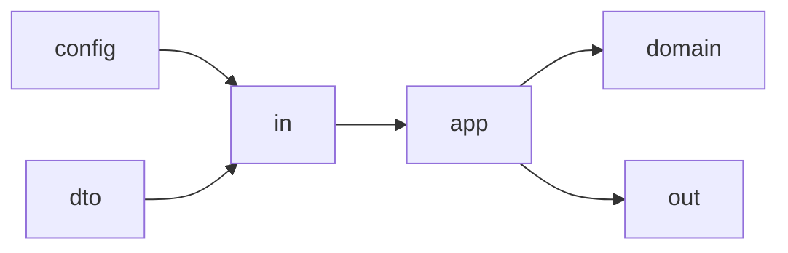

# Package Structure

Last updated: 2026-03-11

## Top-level

```text
.
├── back
├── front
├── deploy
├── infra
└── docs
```

| 디렉터리 | 역할 | 진입점 |
| --- | --- | --- |
| `back` | Spring Boot + Kotlin 백엔드 | `BackApplication.kt` |
| `front` | Next.js + React 프론트엔드 | `src/pages/*` |
| `deploy` | 홈서버 운영/배포 스크립트 | `homeserver/blue_green_deploy.sh` |
| `infra` | 인프라 참고 문서 | `infra/README.md` |
| `docs` | 설계/운영 문서 | 현재 문서 세트 |

## Backend 패키지 규칙

백엔드는 `com.back.boundedContexts.<context>` 패턴을 중심으로 구성된다.

```text
boundedContexts/
├── home
├── member
└── post
```



각 컨텍스트에서 주로 쓰는 하위 패키지:

- `app`
  유스케이스/퍼사드/애플리케이션 서비스
- `config`
  보안/설정/바인딩
- `domain`
  엔티티와 도메인 정책
- `dto`
  API 응답/입력 모델
- `in`
  Controller, inbound adapter
- `out`
  Repository, 외부 연동 adapter
- `event`
  도메인 이벤트
- `subContexts`
  하위 기능 영역

글로벌 공통 코드는 다음에 모여 있다.

- `com.back.global`
- `com.back.standard`

## Frontend 패키지 규칙

프론트는 Pages Router 기반이며, 기능별 역할이 비교적 분리되어 있다.

- `src/pages`
  Next.js 라우트 엔트리
- `src/routes`
  페이지 본문 컴포넌트 조합
- `src/apis`
  API client
- `src/hooks`
  React Query 및 화면 훅
- `src/layouts`
  공통 레이아웃
- `src/components`
  범용 컴포넌트
- `src/styles`
  테마/토큰/반응형 규칙
- `src/libs`
  라우터 보조, 날짜 포맷, 기타 유틸리티

## Frontend 레이어 표

| 레이어 | 예시 경로 | 책임 |
| --- | --- | --- |
| Page entry | `src/pages/admin.tsx` | 라우트 엔트리, SSR/redirect |
| Route composition | `src/routes/Feed/*` | 화면 조합 |
| API layer | `src/apis/backend/*` | fetch 계약 |
| Hook layer | `src/hooks/*` | 상태/React Query |
| Shared UI | `src/components/*` | 범용 UI |
| Theme/Layout | `src/layouts/*`, `src/styles/*` | 앱 전역 스타일 |

## 현재 구조에서 주의할 이름

- `src/routes/Detail/components/NotionRenderer`
  이름은 NotionRenderer지만 현재는 백엔드 Markdown 본문 렌더링/콜아웃/코드블럭/머메이드 스타일링 역할을 한다.
- `src/libs/utils/notion/*`
  원본 템플릿 유산이 일부 남아 있지만, 실제 글 데이터 조회는 `src/apis/backend/posts.ts`를 사용한다.

## 배포 관련 구조

- `deploy/homeserver`
  운영 Compose, Caddy, 배포/복구 스크립트
- `.github/workflows`
  CI/CD 워크플로

## 수정 영향 범위 표

| 변경 위치 | 주 영향 |
| --- | --- |
| `back/boundedContexts/post/*` | 글 작성, 목록, 상세, 관리자 글 관리 |
| `back/boundedContexts/member/*` | 로그인, 회원가입, 관리자 판별 |
| `front/src/apis/backend/*` | 프론트 전체 데이터 계약 |
| `front/src/pages/admin.tsx` | 관리자 운영 UX |
| `deploy/homeserver/*` | 운영 배포/라우팅 |

## 권장 유지 원칙

- 새 기능은 `boundedContexts` 단위로 넣고, `global`에는 진짜 공통 로직만 둔다.
- 프론트는 `pages`에 로직을 몰지 말고 `routes`, `hooks`, `apis`로 분산한다.
- 인프라 변경은 `deploy/`와 문서를 함께 수정한다.
